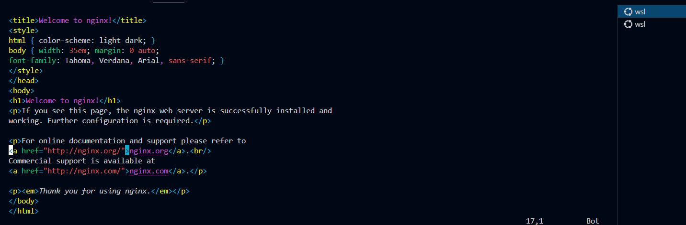

# Basic Commands

- `docker run {name}`: Executes the image.

- `docker ps`: Lists running containers.

- `docker ps -a`: Lists all containers, including those that have stopped.

- `-i`: Interactive mode.
- `-t`: TTY - Allows input in the terminal. Typically used together as `-it`.

Example: `docker run -it --rm ubuntu bash`

- `--rm`: Automatically removes the container once it exits.

Redirecting the port when I'm going to run a container, example:
`docker run -p 8080:80 nginx`

Now if I open: `http://localhost:8080/`


If the container "locks" your terminal after `-run`, you can execute:

`docker run -d -p 80:80 nginx`

Because when we run `-d` (detached mode), we are preventing the terminal from getting stuck in execution.

If you need to remove a container, just execute:
`docker rm {ContainerId Or Name}` -> `docker rm 133601884b1b` or `docker rm blissful_jepsen` 

or to remove and kill
`docker rm {name or id} -f`
## Accessing and modifying files in a container

What if I want to enter my `nginx` container? (which is already running)

We can use `docker exec`, it executes a command in our `container`

Example: `docker exec nginx ls` 

If you want to access `bash`: `docker exec -it nginx bash`

I can navigate normally after:

```bash
joaopelisson@NOTE-JOAO:/mnt/Develop/Trail_FullCycle$ docker exec -it nginx bash
root@1df50eed56af:/# cd /usr/share/nginx/html/
root@1df50eed56af:/usr/share/nginx/html# ls
50x.html  index.html
root@1df50eed56af:/usr/share/nginx/html#
```
And if I want to edit `index.html`? Let's use `vim`!

For this, we will install `vim` if we don't have it: 

```bash
apt-get update
apt-get install vim
```

After successful installation, just execute: `vim index.html`



Note: it started in read mode, to enter edit mode, you need to type `i` which will change to `INSERT` mode

Let's say I've already edited what I wanted, and now, how do I exit? `ESC` and it will exit `INSERT` mode and to save `SHIFT`+`:` and type `w` (W = Write) and done, it saved our file!

Now I go back to my page:


That is, I edited a file that is inside my container.

And now, how do I exit `vim`? Just type `:` `Q` (Q = Quit)
and done:

```bash
root@1df50eed56af:/usr/share/nginx/html# vim index.html
root@1df50eed56af:/usr/share/nginx/html#
```

Note: our container is always immutable - that is, if my container dies, this change I made will go away (the moment it dies)

---

### Bind Mounts

Basically, I mount a volume from my computer into the container.

This way, if the container dies, the file is still on my computer.

When running:
```bash
docker run -d --name nginx -p 8080:80 -v ~/Docker/UtilitiesForExample/:/usr/share/nginx/html nginx
```
By using `-v`, I am specifying that I want to mount a volume and then the path. After the `/:/`, I am indicating where I want to store it inside the container.

_Note: the `-v` command is an "old" command, the current command is `--mount`

In other words:

```bash
docker run -d --name nginx -p 8080:80 --mount type=bind,source="$(pwd)"/Docker/UtilitiesForExample/,target=/usr/share/nginx/html nginx
```