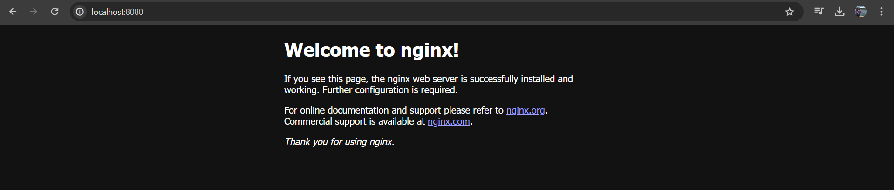

# Basic Commands

- `docker run {name}`: Executes the image.

- `docker ps`: Lists running containers.

- `docker ps -a`: Lists all containers, including those that have stopped.

- `-i`: Interactive mode.
- `-t`: TTY - Allows input in the terminal. Typically used together as `-it`.

Example: `docker run -it --rm ubuntu bash`

- `--rm`: Automatically removes the container once it exits.

Redirecting the port when I'm going to run a container, example:
`docker run -p 8080:80 nginx`

Now if I open: `http://localhost:8080/`

If the container "locks" your terminal after `-run`, you can execute:

`docker run -d -p 80:80 nginx`

Because when we run `-d` (detached mode), we are preventing the terminal from getting stuck in execution.

If you need to remove a container, just execute:
`docker rm {ContainerId Or Name}` -> `docker rm 133601884b1b` or `docker rm blissful_jepsen` 

or to remove and kill
`docker rm {name or id} -f`