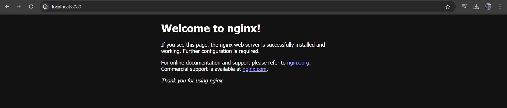
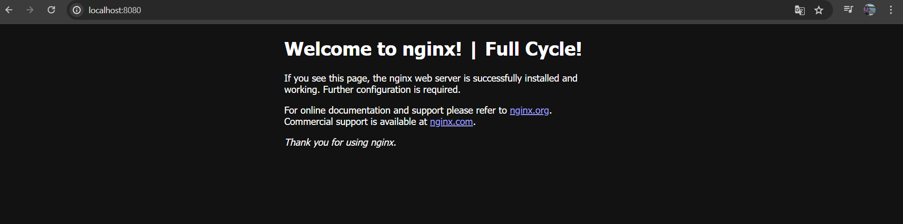

# Comandos básicos 

- `docker run {name}`: Para executar a imagem

- `docker ps`: Containers que estão rodando

- `docker ps -a`: Containers que já executaram, mas já "morreram" algum momento.

- `-i`: Modo interativo
- `-t`: TTY - Basicamente para nós poder digitar coisas no terminal. Normalmente são usados junntos `-it`

Exemplo: `docker run -it --rm ubuntu bash`

- `--rm`: Todo processo de container que subir, na hora que ele "sair", você já remove automaticamente.

Redirecionando a porte quando vou rodar um container, exemplo:
`docker run -p 8080:80 nginx`

Agora se eu abrir: `http://localhost:8080/`



Se caso o container "prenda" seu terminal após o `-run` você pode executar:

`docker run -d -p 80:80 nginx`

Pois quando rodamos `-d` (detached mode) estamos evitando que o terminal fique preso na execução

Caso precise remover um container, basta executar:
`docker rm {ContainerId Ou Name}` -> `docker rm 133601884b1b` ou `docker rm blissful_jepsen` 

ou remover e matar
`docker rm {name ou id} -f`

## Acessando e alterando arquivos de um container

E se eu quiser entrar no meu container `nginx`? (que já esta rodando)

podemos usar o `docker exec`, ele executa um comando no nosso `container`

exemplo: `docker exec nginx ls` 

Caso queira acessar o `bash`: `docker exec -it nginx bash`

Posso navegar normalmente após:
```bash
joaopelisson@NOTE-JOAO:/mnt/Develop/Trail_FullCycle$ docker exec -it nginx bash
root@1df50eed56af:/# cd /usr/share/nginx/html/
root@1df50eed56af:/usr/share/nginx/html# ls
50x.html  index.html
root@1df50eed56af:/usr/share/nginx/html#
```
e caso eu queira editar o `index.html`? Vamos usar o `vim`!

Para isso, vamos instalar o `vim` caso não tenhamos: 

```bash
apt-get update
apt-get install vim
```

após o sucesso da instalação, basta executar: `vim index.html`


obs: ele iniciou em modo de leitura, para entrar em modo de edição, é necessário digitar `i` que ira mudar para modo de `INSERT`

Digamos que eu editei já o que queria, e agora, como eu saio? `ESC` e ele vai sair do modo `INSERT` e para salvar `SHIFT`+`:` e digito `w` (W = Write) e pronto, ele gravou nosso arquivo!

Agora eu volto para minha pagina:


Ou seja, eu editei um arquivo que esta dentro do meu container.

E Agora, como que eu saio do `vim`? Basta digitar `:` `Q` (Q = Quit)
e pronto:

```bash
root@1df50eed56af:/usr/share/nginx/html# vim index.html
root@1df50eed56af:/usr/share/nginx/html#
```

Observação: nosso container é sempre imutavel - ou seja, se meu container morrer, essa minha alteração, vai embora (no momento que ele morre)

---

### Bind mounts

Básicamente eu monto um volume do meu computador, para dentro do container.

Dessa forma, se o container morrer, o arquivo ainda esta dentro do meu computador.

Ao rodar: 
```bash
docker run -d --name nginx -p 8080:80 -v ~/Docker/UtilitiesForExample/:/usr/share/nginx/html nginx
```
Ao utilizar o `-v` eu estou dizendo que vou montar um volume e em seguida o caminho.
após o `/:/` estou dizendo que quero guardar no caminho que vem em seguida do comando.

_Obs: o comando `-v` é um comando "antigo", o comando atual é `--mount`

Ou seja:

```bash
docker run -d --name nginx -p 8080:80 --mount type=bind,source="$(pwd)"/Docker/UtilitiesForExample/,target=/usr/share/nginx/html nginx
```

---

### Trabalhando com volumes

Ao rodar `docker volume` ele me lista alguams ações que posso fazer, por exemplo:

```bash
docker volume ls
```

Criando um volume:

```bash
docker volume create nomedovolume
```

após isso, ao rodar o `ls` vejo o volume criado, podendo rodar um `docker volume inspect nomedovolume` para ter mais detalhes como `mountpoint, drivers, etc`.